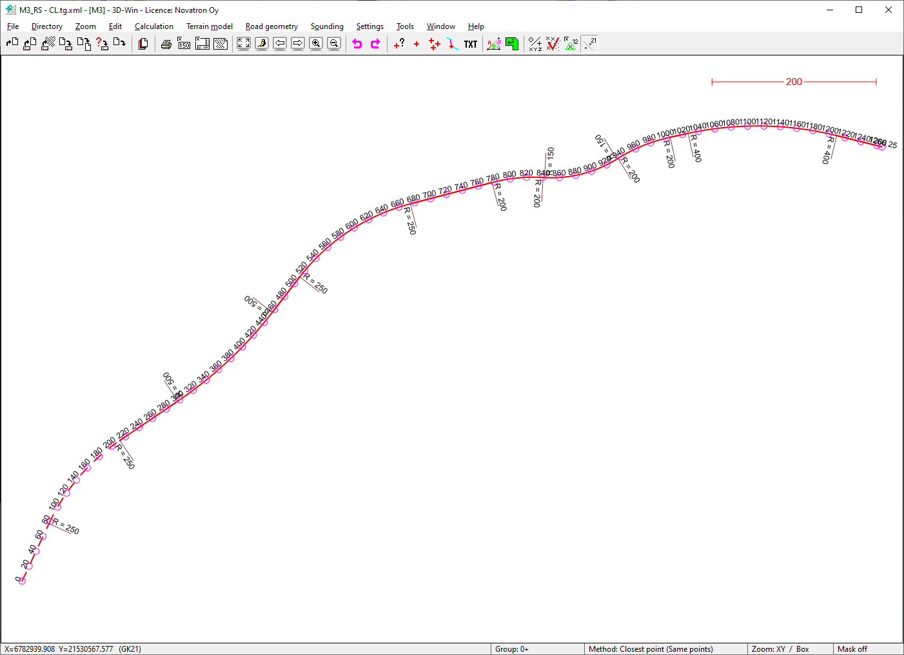
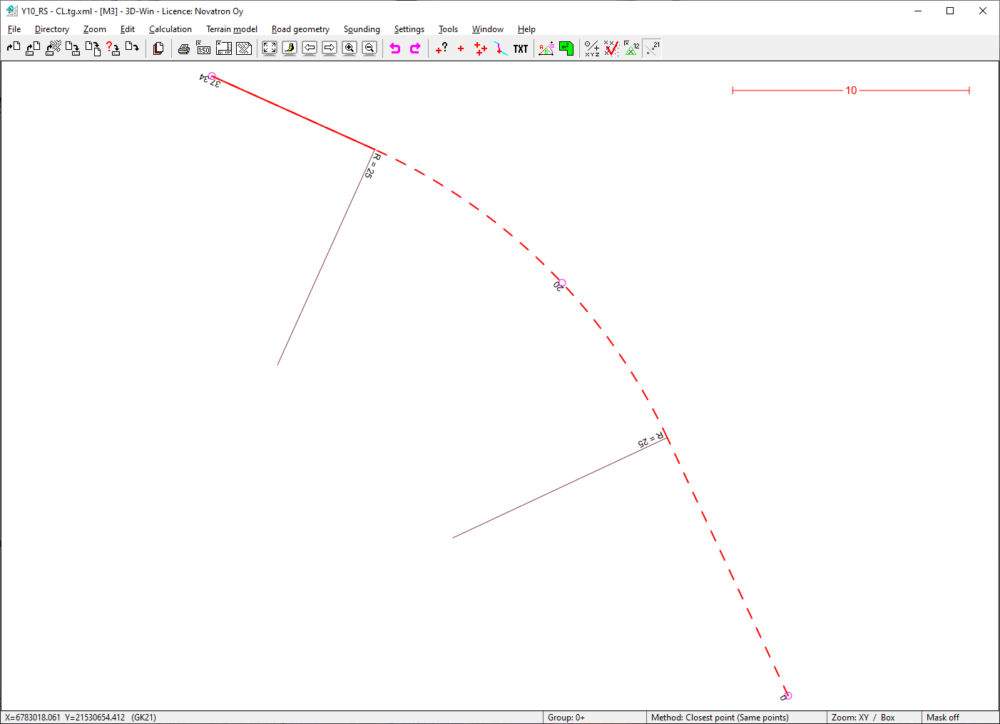
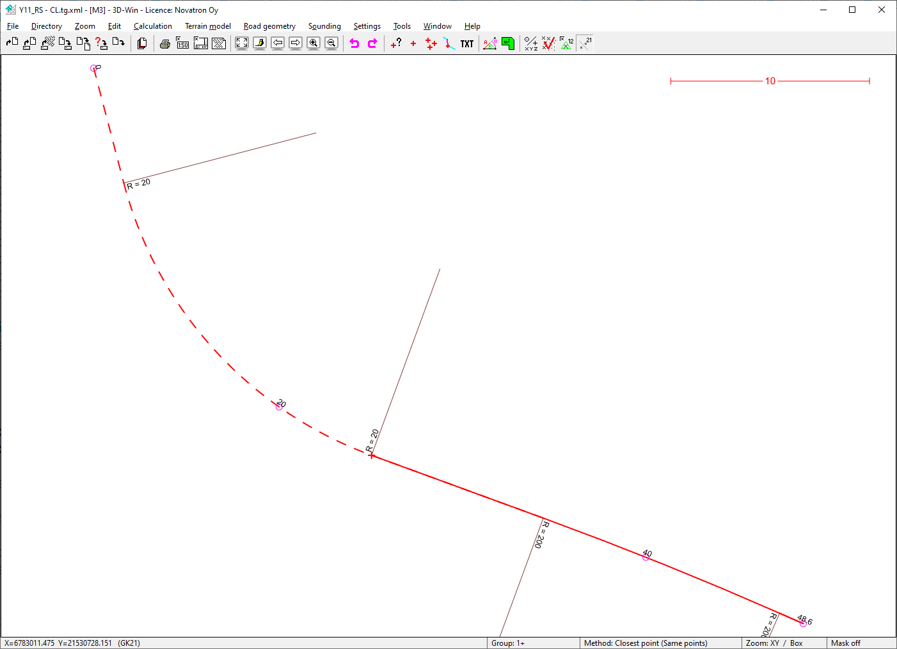

### Description

Road construction example dataset M3_Road
This sample dataset covers road geometries

### Content

This sample data set covers the following LandXML plan types:
- Route/Road

This sample data set covers the following InfraModel LandXML element types:
- Alignment(s)
- IM_Codings feature extension

### Illustrative image(s) of sample data set

### Files

Following files/subfolders belong to this sample data set:

| Filename                          | Description                               |
|-----------------------------------|-------------------------------------------|
|[M3_RS-CL.tg.xml](M3_RS-CL.tg.xml)|Main road M3 geometry|
|[Y10_RS-CL.tg.xml](Y10_RS-CL.tg.xml)|Intersecting road Y10 geometry|
|[Y11_RS-CL.tg.xml](Y11_RS-CL.tg.xml)|Intersecting road Y10 geometry| 
