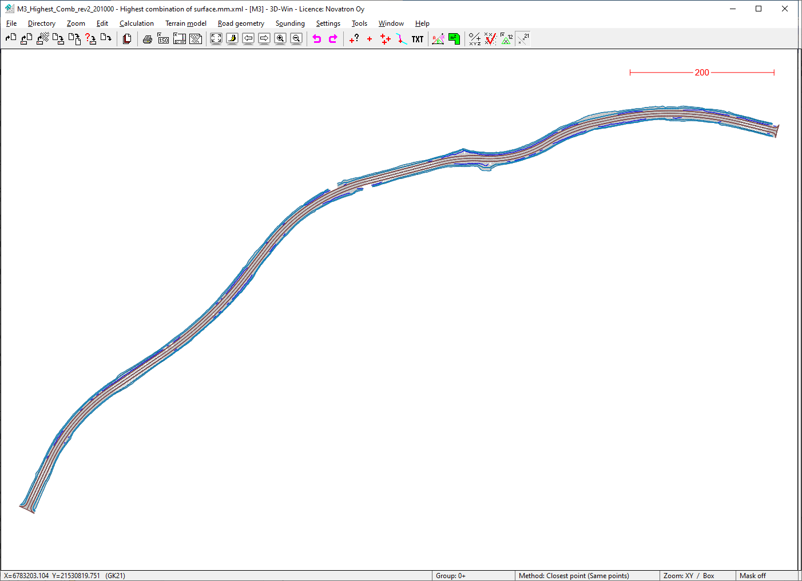
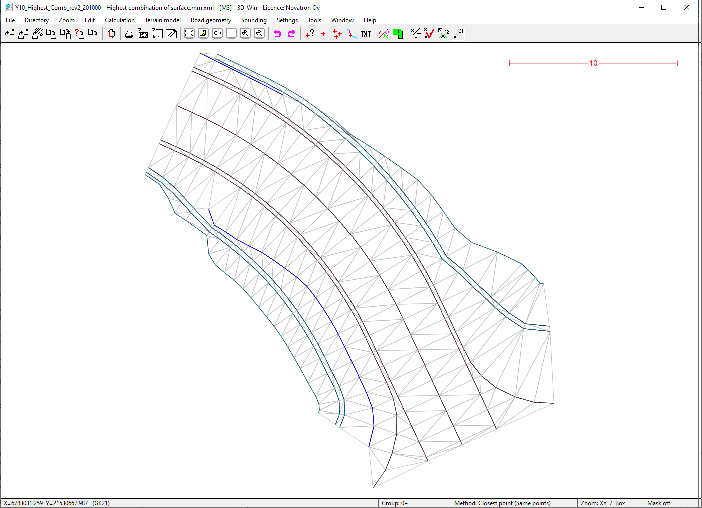
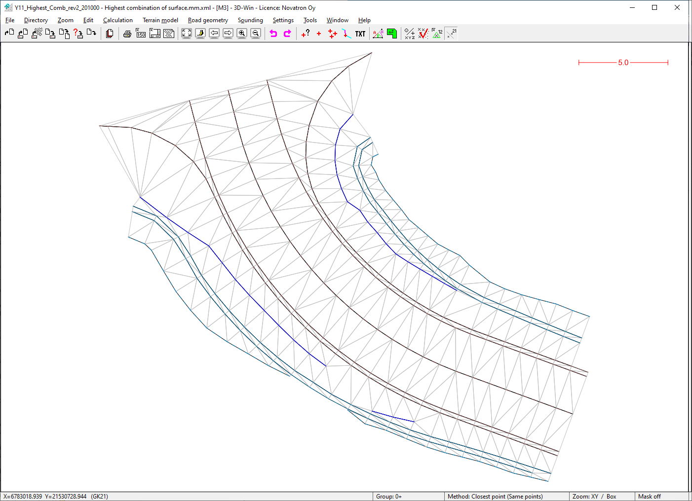

### Description

Road construction example dataset M3_Road
This sample dataset covers surfaces on "highest combination of surfaces" category

### Content

This sample data set covers the following  plan types:
- Route/Road

This sample data set covers the following InfraModel LandXML element types:
- Surface
- Surface->sourcedata->breaklines
- IM_Codings feature extension

### Illustrative image(s) of sample data set

### Files

Following files/subfolders belong to this sample data set:

| Filename                          | Description                               |
|-----------------------------------|-------------------------------------------|
|[M3_Highest_Comb_rev2_Highest_combination_of_surface.mm.xml](M3_Highest_Comb_rev2_Highest_combination_of_surface.mm.xml)|Main road M3 highest combination of surfaces with breaklines|
|[Y10_Highest_Comb_rev2_Highest_combination_of_surface.mm.xml](Y10_Highest_Comb_rev2_Highest_combination_of_surface.mm.xml)|Intersecting road Y10 highest combination of surfaces with breaklines|
|[Y11_Highest_Comb_rev2_Highest_combination_of_surface.mm.xml](Y11_Highest_Comb_rev2_Highest_combination_of_surface.mm.xml)|Intersecting road Y10 highest combination of surfaces with breaklines| 
