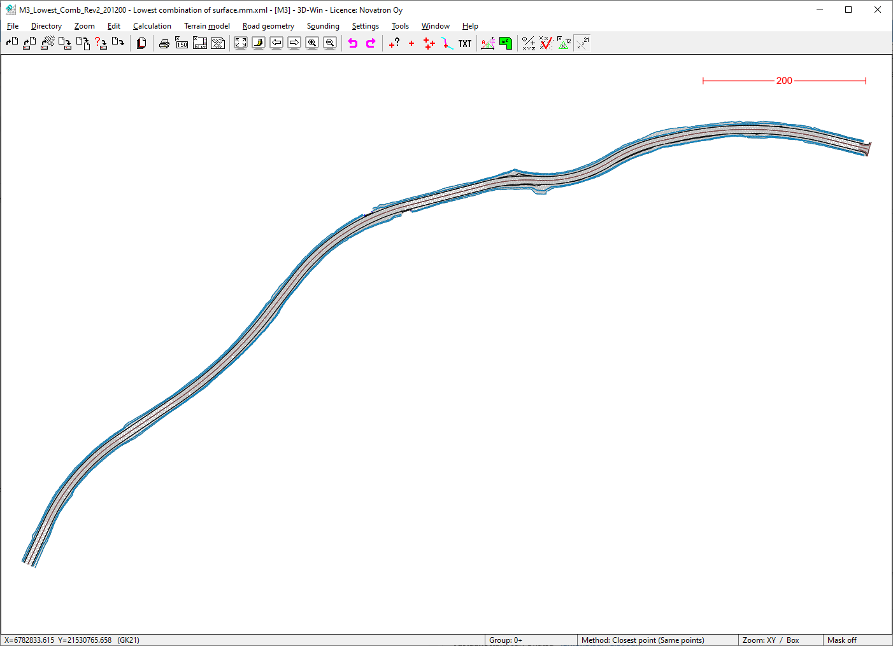
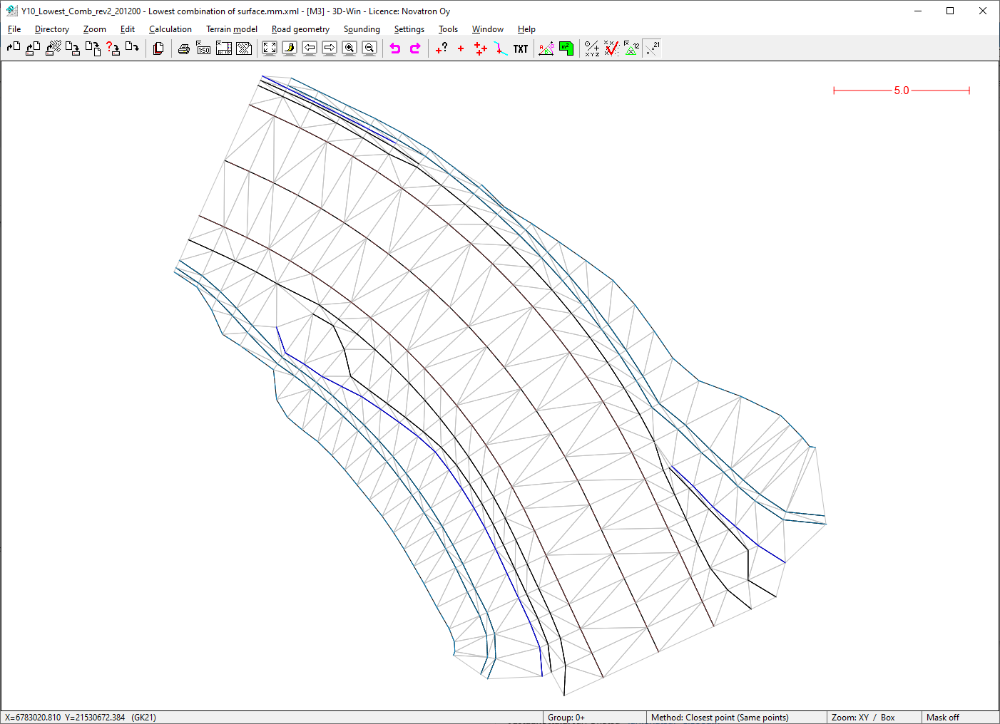
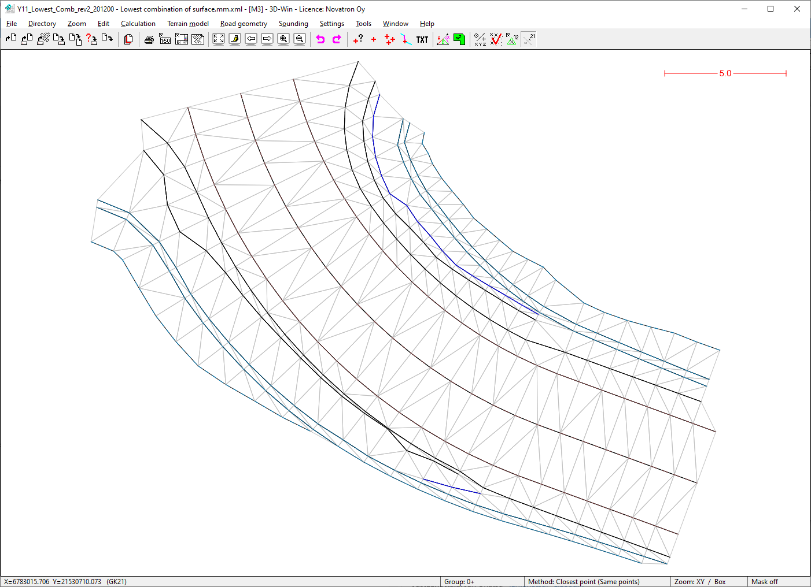

### Description

Road construction example dataset M3_Road, real design data from western Finland
This sample dataset covers surfaces on "lowest combination of surfaces" category

### Content

This sample data set covers the following ISO15143-4 subset of LandXML plan types:
- Route/Road

This sample data set covers the following ISO15143-4 subset of LandXML element types:
- Surface
- Surface->sourcedata->breaklines
- ISO15143-4 taxonnomy extension

### Illustrative image(s) of sample data set

### Files

Following files/subfolders belong to this sample data set:

| Filename                          | Description                               |
|-----------------------------------|-------------------------------------------|
|[M3_Road-codelist-1.json](../M3_Road-codelist-1.json)|Finnish InfraBIM construction coding V2.32|
|[M3_Lowest_Comb_Rev2_Lowest_combination_of_surface.mm.xml](M3_Lowest_Comb_Rev2_Lowest_combination_of_surface.mm.xml)|Main road M3 lowest combination of surfaces with breaklines|
|[Y10_Lowest_Comb_rev2_Lowest_combination_of_surface.mm.xml](Y10_Lowest_Comb_rev2_Lowest_combination_of_surface.mm.xml)|Intersecting road Y10 lowest combination of surfaces with breaklines|
|[Y11_Lowest_Comb_rev2_Lowest_combination_of_surface.mm.xml](Y11_Lowest_Comb_rev2_Lowest_combination_of_surface.mm.xml)|Intersecting road Y10 lowest combination of surfaces with breaklines| 
