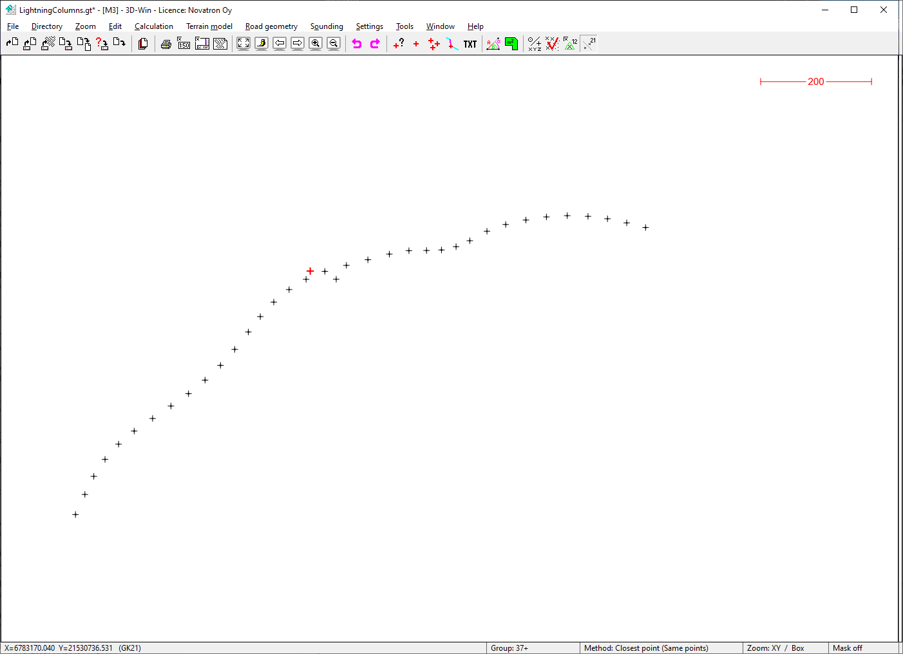

### Description

Road construction example dataset M3_Road, real design data from western Finland
This sample dataset covers light pole footing positions

### Content

This sample data set covers the following ISO15143-4 subset of LandXML element types:
- Planfeature points
- ISO15143-4 taxonomy extension

### Illustrative image(s) of sample data set

### Files

Following files/subfolders belong to this sample data set:

| Filename                          | Description                               |
|-----------------------------------|-------------------------------------------|
|[M3_Road-codelist-1.json](../M3_Road-codelist-1.json)|Finnish InfraBIM construction coding V2.32|
|[LightingColumns.xy.xml](LightingColumns.xy.xml)|Light pole footing locations|

