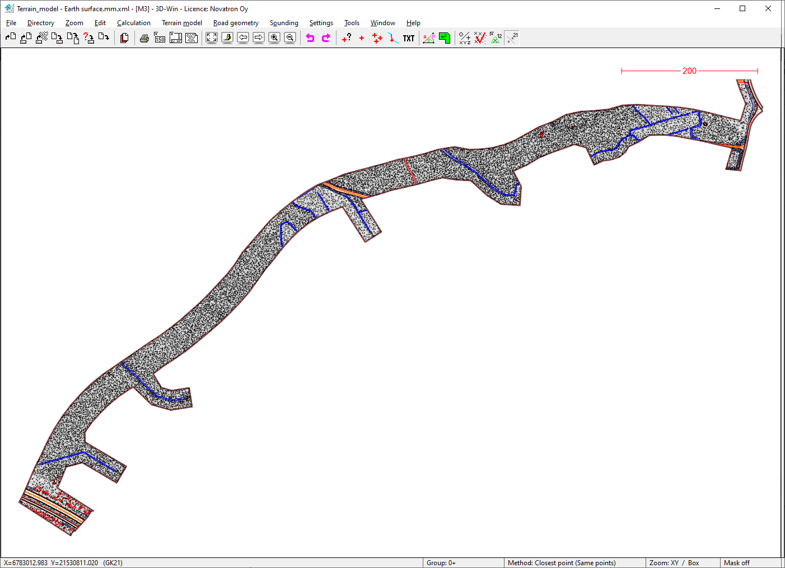
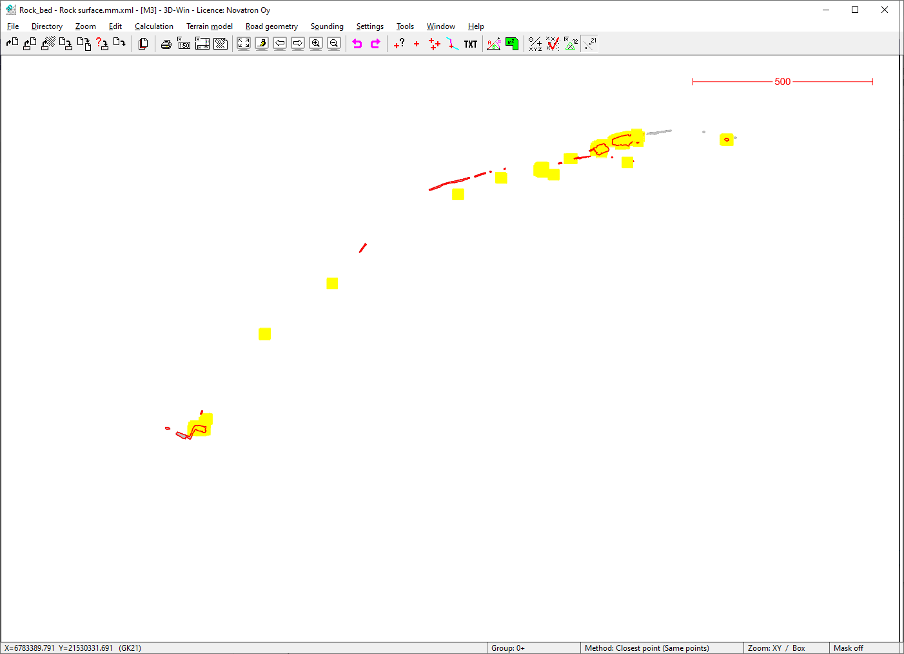

### Description

Road construction example dataset M3_Road, real design data from western Finland
This sample dataset covers pre-construction earth and rock bed surfaces (ie. initial data for the worksite)

### Content

This sample data set covers the following plan types:
- Areal planning / Terrain model

This sample data set covers the following InfraModel LandXML element types:
- Surface
- Surface->sourcedata->breaklines
- IM_Codings feature extension

### Illustrative image(s) of sample data set

### Files

Following files/subfolders belong to this sample data set:

| Filename                          | Description                               |
|-----------------------------------|-------------------------------------------|
|[M3_Terrain.mm.xml](M3_Terrain.mm.xml)|Current earth surface (pre-construction)|
|[M3_Rockbed_survey.mm.xml](M3_Rockbed_survey.mm.xml)|Current rock bed surface (pre-construction)|

