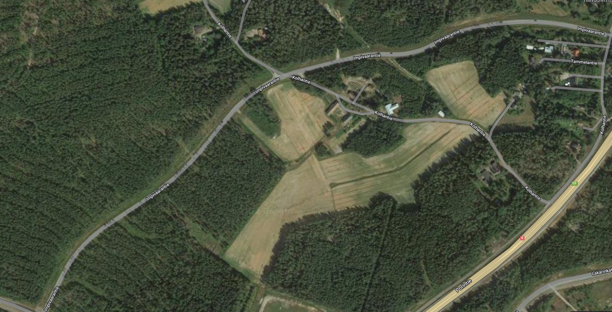
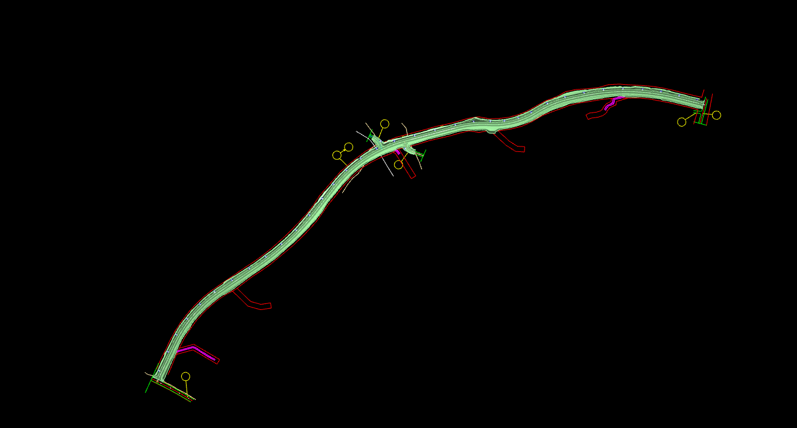
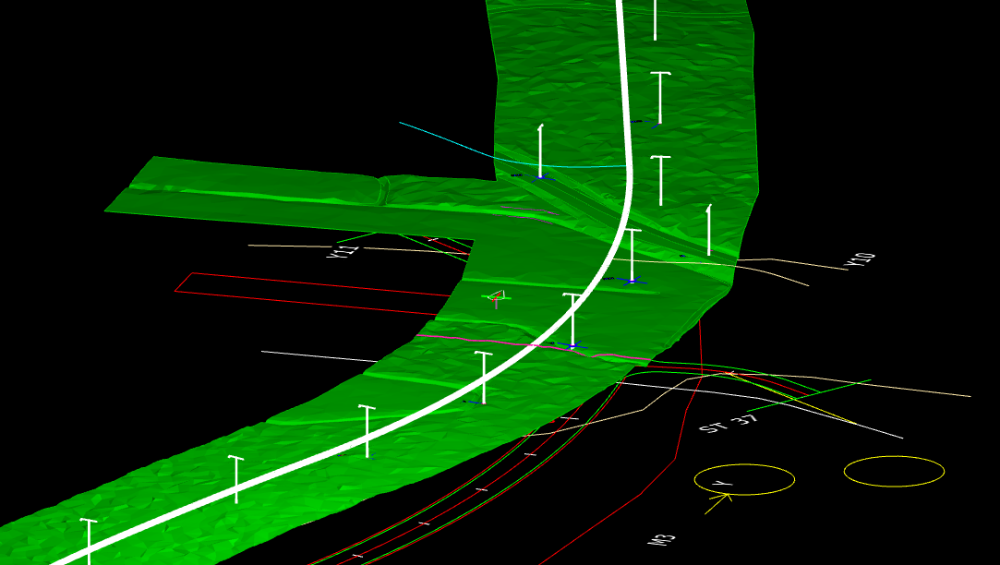
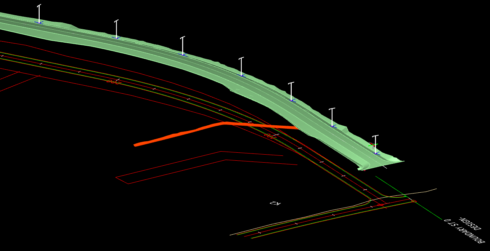

### Description

Road construction dataset M3_Road

Project WGS84 boundary: 

61.152,21.561

61.157,21.561

61.157,21.582

61.152,21.582

### Content

This sample data set covers the following plan types:
- Route / road planning
- Areal planning
~~- Pipe network planning~~
- Existing terrain

This sample data set covers the following Inframodel LandXML element types:
- Alignment
- Surface
~~- Planfeature~~
~~- Pipenetworks~~

### Illustrative image(s) of sample data set

### Files

Following files/subfolders belong to this sample data set:

| Filename                          | Description                               |
|-----------------------------------|-------------------------------------------|
|[0000_Alignments](0000_Alignments)|Subfolder containing road geometries|
|[2010_Highest_surface](2010_Highest_surface)|Subfolder containing highest combination of surface|
|[2012_Lowest_surface](2012_Lowest_surface)|Subfolder containing lowest combination of surface|
|[3300_Lighting](3300_Lighting)|Subfolder containing light pole footings|
|[9004_Terrain_models](9004_Terrain_models)|Subfolder containing terrain models|

